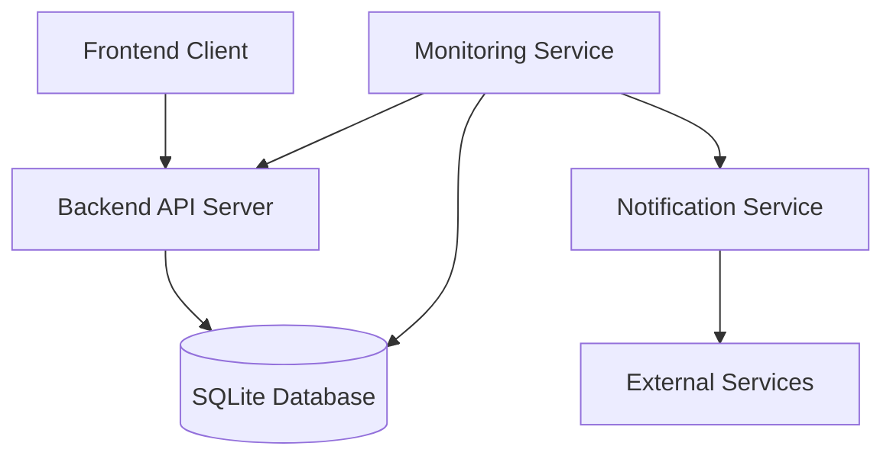
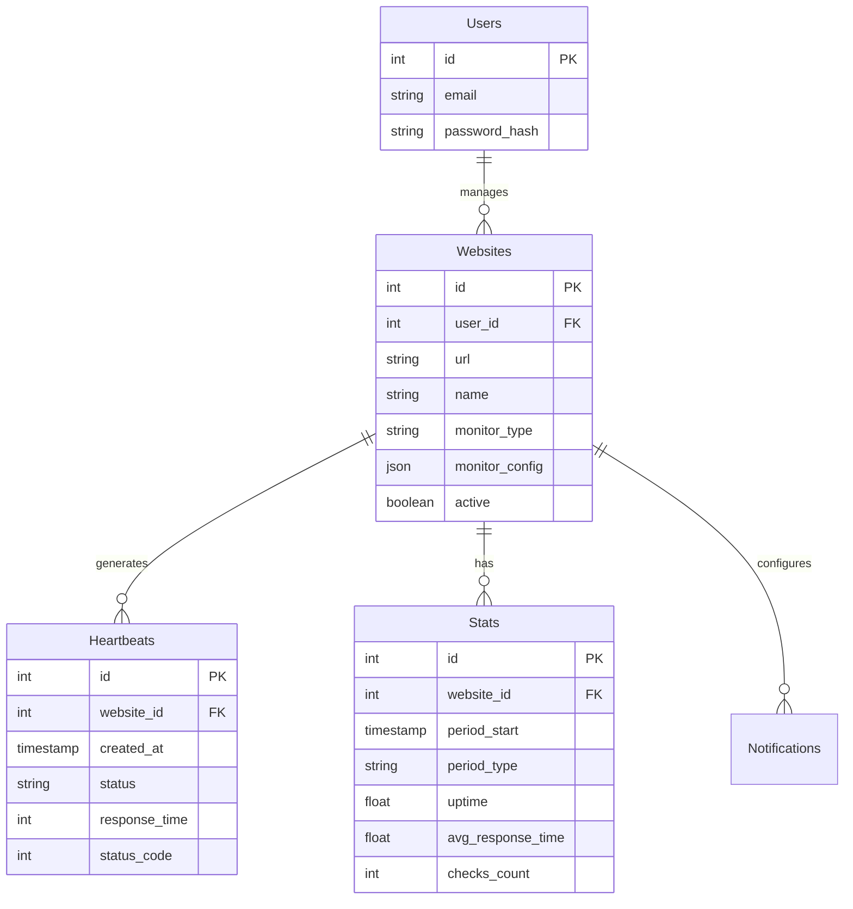
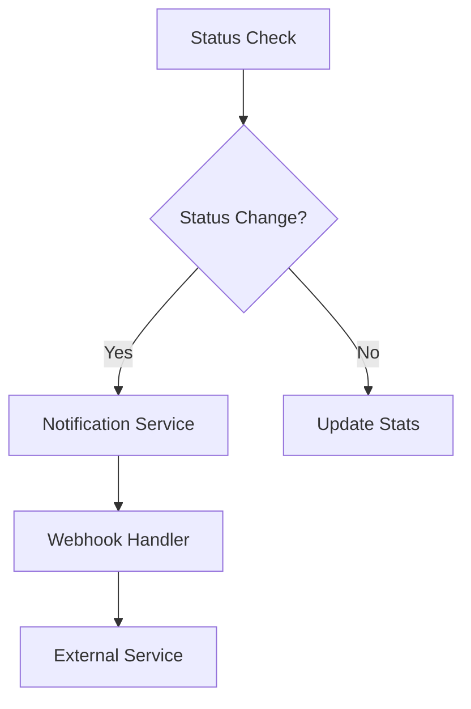
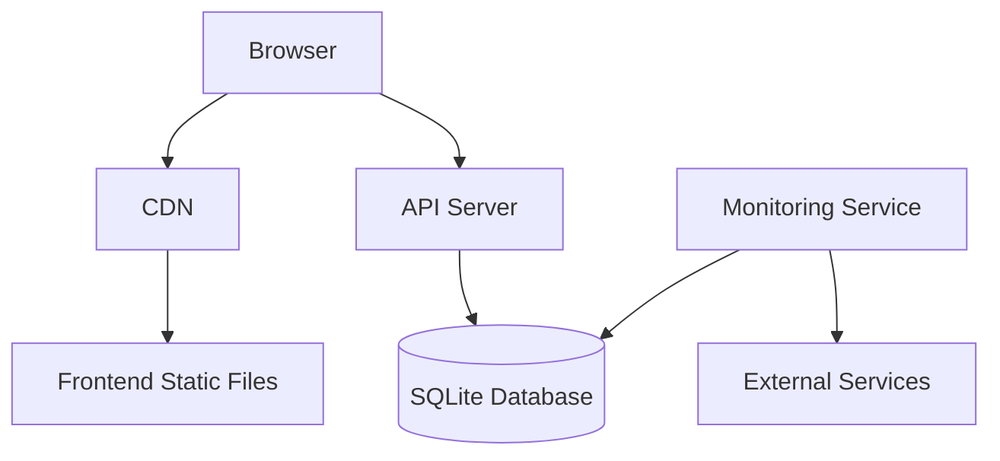

# Architecture Overview

## System Architecture



## Core Components

### 1. Frontend (React + TypeScript)

- **Authentication Context**
  - Manages user sessions
  - Handles JWT token storage and validation

- **Dashboard Components**
  - Real-time status displays
  - Performance charts and statistics
  - Website management interface

- **Settings Management**
  - Notification configuration
  - User preferences
  - Monitor configurations

### 2. Backend Server (Node.js + Express)

- **API Layer**
  - RESTful endpoints
  - JWT authentication middleware
  - Request validation
  - Response formatting

- **Service Layer**
  - Website management
  - Statistics processing
  - Notification handling
  - Uptime calculations

- **Database Layer**
  - SQLite connection management
  - Query execution
  - Migration handling

### 3. Monitoring Service

- **Checker System**
  ```mermaid
  graph LR
      Scheduler --> Checker
      Checker --> HTTP[HTTP Checks]
      Checker --> Stats[Stats Collection]
      Stats --> DB[(Database)]
      HTTP --> Notifier[Notification Service]
  ```

- **Components**
  - Scheduler: Manages check timing and frequency
  - Checker: Performs actual monitoring operations
  - Stats Collector: Aggregates and processes results

### 4. Database Schema



## Key Features Implementation

### 1. Website Monitoring

The monitoring system follows this process:
1. Scheduler triggers checks at configured intervals
2. Checker performs HTTP requests to monitored endpoints
3. Results are recorded as heartbeats
4. Statistics are aggregated at different intervals
5. Notifications are triggered based on status changes

### 2. Statistics Processing

Statistics are maintained at three levels:
- Minutely: Raw data points
- Hourly: Aggregated from minutely stats
- Daily: Aggregated from hourly stats

### 3. Notification System



## Development Workflow

### 1. Code Organization

```
uptimefel/
├── src/                    # Frontend source
│   ├── components/         # React components
│   ├── contexts/          # React contexts
│   ├── services/          # API clients
│   └── types/             # TypeScript types
│
├── server/                 # Backend source
│   ├── src/
│   │   ├── auth/          # Authentication
│   │   ├── controllers/   # Route handlers
│   │   ├── database/      # Database operations
│   │   ├── monitoring/    # Monitoring logic
│   │   ├── routers/       # Express routes
│   │   └── services/      # Business logic
│   └── migrations/        # Database migrations
```

### 2. Data Flow

1. **Frontend to Backend**
   - API requests through service layer
   - JWT token in Authorization header
   - TypeScript types shared between front/back

2. **Monitor to Database**
   - Regular status checks
   - Results stored as heartbeats
   - Aggregated into statistics

3. **Notification Flow**
   - Status changes detected
   - Notification rules checked
   - Webhooks triggered if configured

## Performance Considerations

1. **Database Optimization**
   - Indexed fields for frequent queries
   - Regular cleanup of old heartbeat data
   - Efficient statistics aggregation

2. **Monitoring Efficiency**
   - Distributed check scheduling
   - Timeout handling
   - Request pooling

3. **Frontend Performance**
   - React component memoization
   - Efficient data fetching
   - Real-time updates via polling

## Security Measures

1. **Authentication**
   - JWT-based authentication
   - Password hashing with bcrypt
   - Token expiration and refresh

2. **API Security**
   - Input validation
   - Rate limiting
   - CORS configuration

3. **Data Protection**
   - Sanitized database queries
   - Encrypted sensitive data
   - User data isolation

## Deployment Architecture



This architecture document serves as a living document and should be updated as the system evolves.
